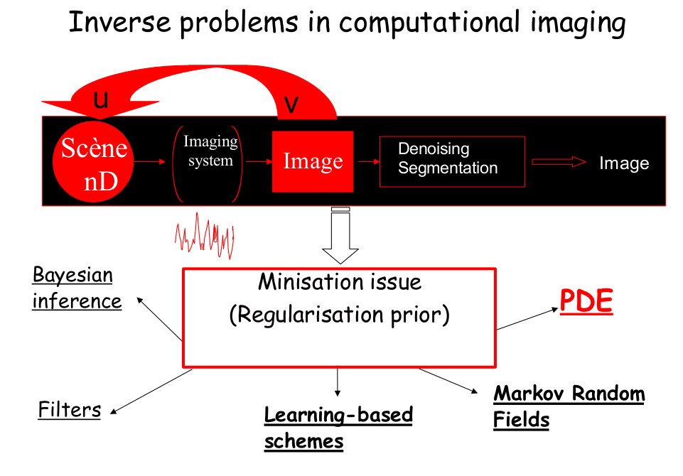

# Partial Differential Equations (PDEs) for Image Denoising

Image Denoising can be cast as an inverse problem to which we exploit PDEs to solve. There are several
approaches dealing with Inverse Problem, resumed in the figure below.

__Author: Khoa NGUYEN__

## Background
In theory, we are looking for a solution $\hat{u}$ by minimizing the following cost:

$\hat{u} = \arg\min_{u \in \mathcal{U}} E(u,v)$

with $E(u,v) = E_{data}(u,v) + E_reg{u}$

where $\mathcal{U}$ is a pixel-value range, corresponding {0,...,255} for RGB images.

The first term represents consistency between the observation $v$ and and the solution $u$, while the second
term is the regulator which depicts an expected property for the solution. In the project, we will expect to study the impact different
regulation terms.

The variational cost over an image by integrating through its spatial information $\Omega$:

$E(u,v) = \int_{p \in \Omega} \mathcal{U}}\| u - v\|^2 + \int_{p \in \Omega} \mathcal{U}}\|\nabla{u}\|^2$

**Data Term**

$E_{data}(u,v) =  \int_{p \in \Omega} \mathcal{U}}\| u - v\|^2 $

The data term considered here is the norm of difference between the solution $u$ and the observation $v$,
which is integrated through the image's spatial information $\Omega$.

**Regulation Term**

    1. Heat Equation (HE)

Considering the prior term (or regularization) as the diffusion term in Heat Equation.

$E_{reg}(u) = \alpha \int_\Omega \|\nabla u(p)\|^2dp$

Minimizing the total energy E(u,v) by applying the gradient descent algorithm:

$u^(k+1) = u^(k) - \lambda*(2*(u^(k)-v) - \alpha \delta{u}^k)$

where $\alpha$ is the weighting factor, $\lambda$ is the gradient step.

    2. Total Variation (TV)

$E_{reg}(u) = \int_\Omega \rho( \|\nabla u(p)\|^2 )dp$

Recall the $\int_\Omega \rho( \|\nabla u(p)\|^2 )dp$, the the diffusion equation will be:

$$ \frac{\partial u}{\partial t}= div \left ( \rho'(\|\nabla u(p)\| )  \frac{\nabla u(p)}{\|\nabla u(p)\|} \right )$$

    3. Perona-Malik Diffusion (PM)

$$ \frac{\partial u}{\partial t}= div \left ( c(\|\nabla u(p)\| )  \nabla u(p) \right )$$
with different choices for function $c()$: $c1(x)=1-exp(-x^2/K^2)$, $c2(x)=\left [1+x^2/K^2\right]^{-1/2}$, $c3(x)=\left [1+x^2/K^2\right]^{-1}$.

