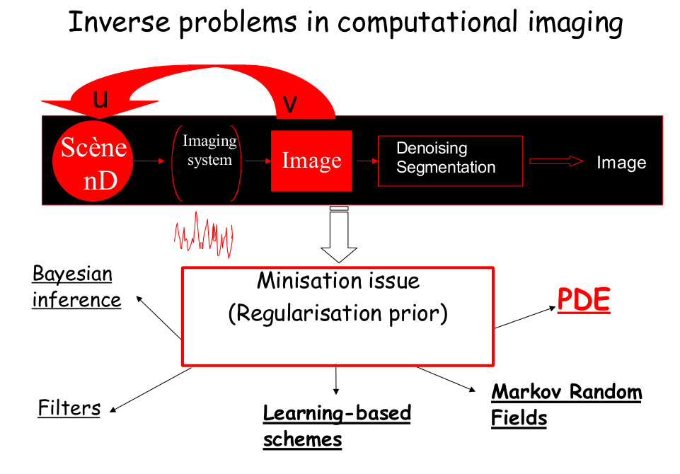

[![Contributors][contributors-shield]][contributors-url]
[![Forks][forks-shield]][forks-url]
[![Stargazers][stars-shield]][stars-url]
[![Issues][issues-shield]][issues-url]
[![MIT License][license-shield]][license-url]
[![LinkedIn][linkedin-shield]][linkedin-url]

<!-- TABLE OF CONTENTS -->

  
Table of Contents

  <ol>
    <li>
      <a href="#about-the-project">About The Project</a>
      <ul>
        <li><a href="#theoretical-background">Theoretical Background</a></li>
      </ul>
    </li>
    <li>
      <a href="#getting-started">Getting Started</a>
      <ul>
        <li><a href="#prerequisites">Prerequisites</a></li>
        <li><a href="#installation">Installation</a></li>
      </ul>
    </li>
    <li><a href="#usage">Usage</a></li>
    <li><a href="#license">License</a></li>
    <li><a href="#contact">Contact</a></li>
    <li><a href="#acknowledgements">Acknowledgements</a></li>
  </ol>

<!-- ABOUT THE PROJECT -->
## About The Project

The project aims to exploit Partial Differential Equations (PDEs) to solve Inverse Problem in Image Denoising. There are other
approaches dealing with Inverse Problem, resumed in Figure below.

### Theoretical Background
In theory, we are looking for a solution  by minimizing the following cost:

with 

where  is a set of possible solutions whose element values corresponding {0,...,255} for RGB images.

The  term represents the consistency between the observation  and and the solution , while the 
term is the regulator which depicts an expected property for the solution. In the project, we will expect to study the impact of different
regularization terms.

**Data Term**

The data term considered here is the norm 2 of difference between the solution  and the observation ,
which is integrated through the image's spatial information .

**Regulation Term**

    1. Heat Equation (HE)

Considering the prior term (or regularization) as the diffusion term in Heat Equation.

Minimizing the total energy E(u,v) by applying the gradient descent algorithm:

*Diffusion Equation* 

where  is the weighting factor,  is the gradient step.

    2. Total Variation (TV)

Recall the , the the diffusion equation will be:

    3. Perona-Malik Diffusion (PM)

with different choices for function : , , .

<!-- GETTING STARTED -->
## Getting Started

### Prerequisites

### Installation

<!-- USAGE EXAMPLES -->
## Usage

<!-- LICENSE -->
## License

Distributed under the MIT License. See `LICENSE` for more information.

<!-- CONTACT -->
## Contact

Khoa NGUYEN - [@v18nguyen](https://twitter.com/v18nguyen) - khoa.v18nguyen@gmail.com

Project Link: [https://github.com/v18nguye/IDwPDEs](https://github.com/v18nguye/IDwPDEs)

<!-- ACKNOWLEDGEMENTS -->
## Acknowledgements
* [Cool README Template](https://github.com/othneildrew/Best-README-Template#built-with)

<!-- MARKDOWN LINKS & IMAGES -->
[contributors-shield]: https://img.shields.io/github/contributors/v18nguye/IDwPDEs.svg?style=for-the-badge
[contributors-url]: https://github.com/v18nguye/IDwPDEs/graphs/contributors
[forks-shield]: https://img.shields.io/github/forks/v18nguye/IDwPDEs.svg?style=for-the-badge
[forks-url]: https://github.com/v18nguye/IDwPDEs/network/members
[stars-shield]: https://img.shields.io/github/stars/v18nguye/IDwPDEs.svg?style=for-the-badge
[stars-url]: https://github.com/v18nguye/IDwPDEs/stargazers
[issues-shield]: https://img.shields.io/github/issues/v18nguye/IDwPDEs.svg?style=for-the-badge
[issues-url]: https://github.com/v18nguye/IDwPDEs/issues
[license-shield]: https://img.shields.io/github/license/v18nguye/IDwPDEs.svg?style=for-the-badge
[license-url]: https://github.com/v18nguye/IDwPDEs/blob/master/LICENSE.txt
[linkedin-shield]: https://img.shields.io/badge/-LinkedIn-black.svg?style=for-the-badge&logo=linkedin&colorB=555
[linkedin-url]: https://www.linkedin.com/in/khoa-nguyen-139b9b15b/